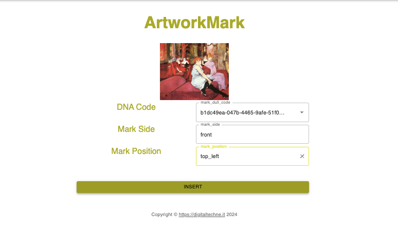

Artwork Mark
#############

Initially you have to put the ink on the artwork. The position is important, you have to specify it later.

After usage the cartridge will be useless, the DNA material will be destroyed by a chemical reaction, in order to avoid unwanted further usage

.. image:: ./lay_ink.png
  :width: 800
  :alt: Dossier

And then the blockchain operation: 
    * select from the first pull down menu the identifier of the ink cartridge
    * select from the second pull down menu the artwork side (front, back or frame)
    * select from the third pull down menu the drop position 

At the end of this blockchain operation a green check mark will appear in the opera documentation

