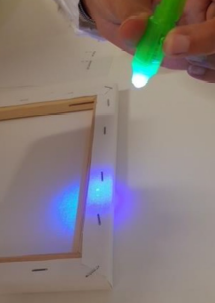

Artwork Mark
#############

Initially you have to put the ink on the artwork. The position is important, you have to specify it while you insert data in blockchain.

After usage the cartridge will be useless, the DNA material will be destroyed by a chemical reaction, in order to avoid unwanted further usage

.. image:: ./lay_ink.png
  :width: 400
  :alt: Dossier

Please note that the ink is completely transparent at the naked eye, and, obviously has been engineered for a long lasting stability

.. image:: ./unvisible_ink.png
  :width: 400
  :alt: Dossier

Using an ultra violet lamp, the ink spot will be visible

Insert in BlockChain
____________________

And then the blockchain operation: 
    * select from the first pull down menu the identifier of the ink cartridge
    * select from the second pull down menu the artwork side (front, back or frame)
    * select from the third pull down menu the drop position 

At the end of this blockchain operation a green check mark will appear in the opera documentation
