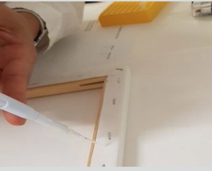
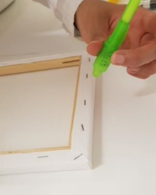
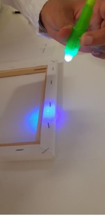
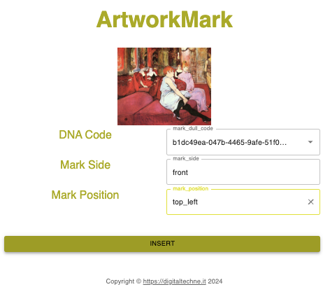

Artwork-Markierung
############################################################################################

Zunächst müssen Sie die Tinte auf das Artwork auftragen. Die Position ist wichtig, Sie müssen sie angeben, während Sie Daten in die Blockchain einfügen.

Nach der Verwendung ist die Patrone unbrauchbar, das DNA-Material wird durch eine chemische Reaktion zerstört, um eine ungewollte weitere Verwendung zu vermeiden

Bitte beachten Sie, dass die Tinte für das bloße Auge völlig transparent ist und offensichtlich für eine lang anhaltende Stabilität entwickelt wurde

Mit einer UV-Lampe wird der Tintenfleck sichtbar

In BlockChain einfügen
__________________________________________________________________________________________________

Und dann die Blockchain-Operation: 
* wählen Sie aus dem ersten Pulldown-Menü die Kennung der Tintenpatrone
* wählen Sie aus dem zweiten Pulldown-Menü die Bildseite (Vorder-, Rückseite oder Rahmen)
* wählen Sie aus dem dritten Pulldown-Menü die Ablageposition

Am Ende dieser Blockchain-Operation erscheint ein grünes Häkchen in der Opera-Dokumentation
