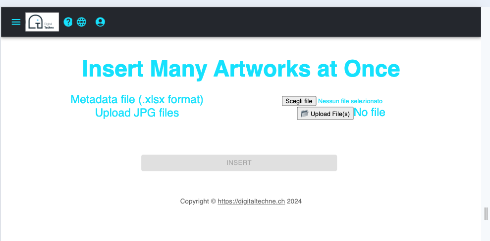

Batch Insert
############

This operation is intended for bulk loading of artworks and metadata

    * Base artwork infos are contained in a Excel file
    * Artworks shall be in jpg format

The Excel file will contain the basic information of an opera, one row per artwork. Header names are meaningful, please use exaclty these names:

    * Photos
    * Date
    * Title
    * Technique 
    * EditionNumber
    * Dimensions
    * date of insertion (auto)
    * owner (inferred from the logged user)

Photos will contain just the number of the photo, that will be mapped to the real file name (f.i. 077 is the file DSC_0077.JPG)

