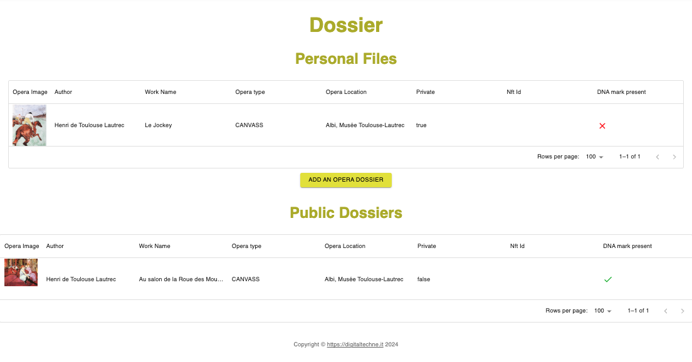

Dossier
#######

This page will show you the artworks hosted on DigitalTechne. They are divided in two sections:
    * Artworks that you own
    * Publicly available artworks

For both sections the data shown is the same: the main information about the opera (title, author and so on), along with a picture

Clicking on a picture will lead you to the detailed information :ref:`Dossier Detail`

A green check icon will indicate that the DNA ink has already been placed on the opera  and the genomic record has been recorded in BlockChain

