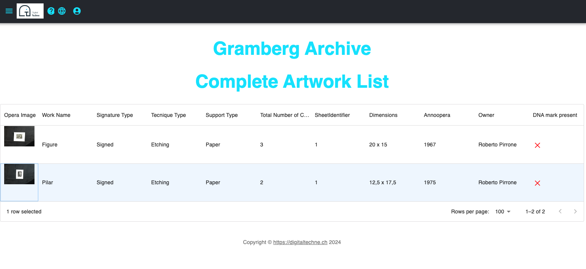
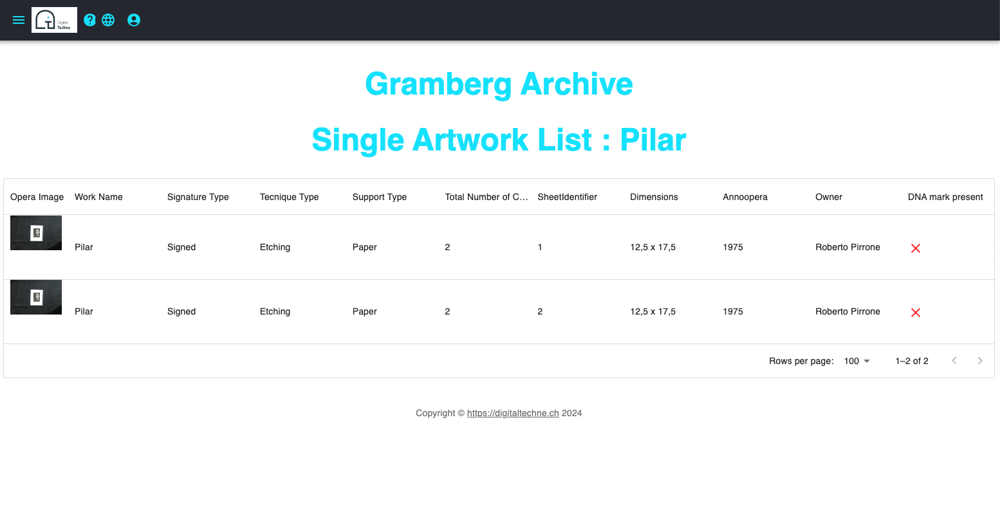

Dossier
#######

This page will show you the artworks hosted on the Archive. 

Each row will contain the main information about a single  opera (title, author and so on), along with a picture

Each artwork is made up of a small number of paper sheets (the main print run, the Artist's proof, the unsigned copies), so 
clicking on the picture will lead you to a page with a row for each physical sheet of a single artwork

Inside this list page the click on the image will lead to the detailed information :ref:`Dossier Detail`

A green check icon will indicate that the DNA ink has already been placed on the opera  and the genomic record has been recorded in BlockChain
