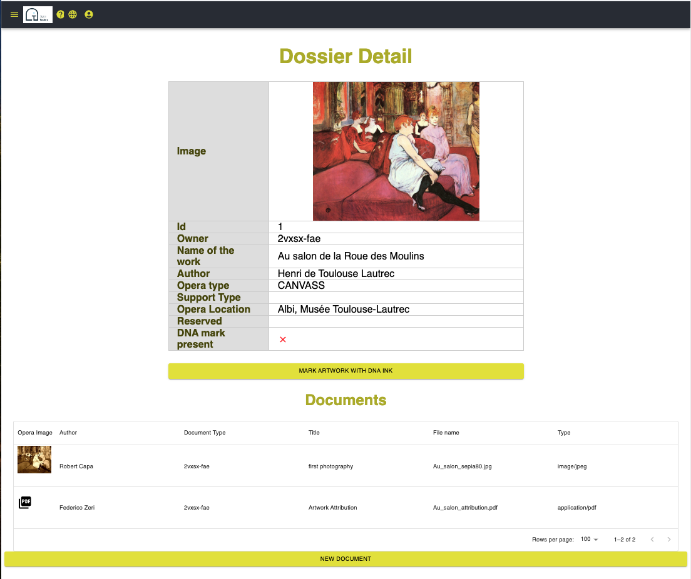

Dossier Detail
##############

This page will show you all the information about the artwork:
    * detailed information
    * a collection of documents

Clicking on each document icon you can download the file, or show the image in full resolution

The button **Mark Artwork with DNA Ink** will allow you to register the association among the ink on the physical artowork and its digital representation (the information shown in this page). See details there: :ref:`Artwork Mark`

When the Dna mark is already registered, a different button will appear: **Verify DNA mark**. It will allow you to verify the authenticity of the mark. The descriptive page is here :ref:`Verify`

