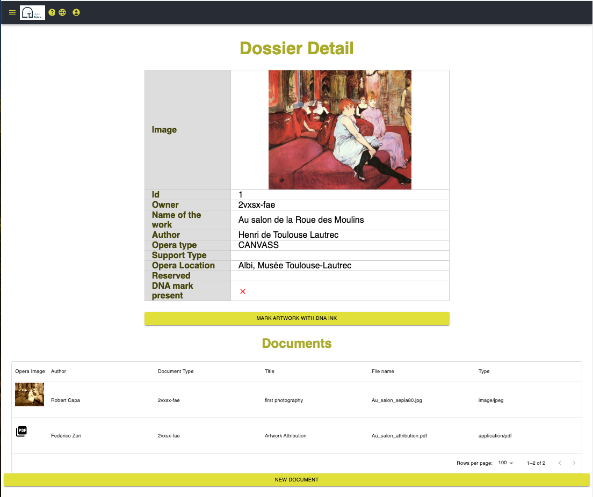

Dettaglio del dossier
###############################################

Questa pagina ti mostrerà tutte le informazioni sull'opera d'arte:
* informazioni dettagliate
* una raccolta di documenti

Cliccando su ogni icona del documento puoi scaricare il file o visualizzare l'immagine a piena risoluzione

Il pulsante **Marca l'opera d'arte con inchiostro DNA** ti consentirà di registrare l'associazione tra l'inchiostro sull'opera d'arte fisica e la sua rappresentazione digitale (le informazioni mostrate in questa pagina). Vedi i dettagli lì: :ref:`Marchio dell'opera d'arte`

Quando il marchio DNA è già registrato, apparirà un pulsante diverso: **Verifica marchio DNA**. Ti consentirà di verificare l'autenticità del marchio. La pagina descrittiva è qui :ref:`Verifica`

