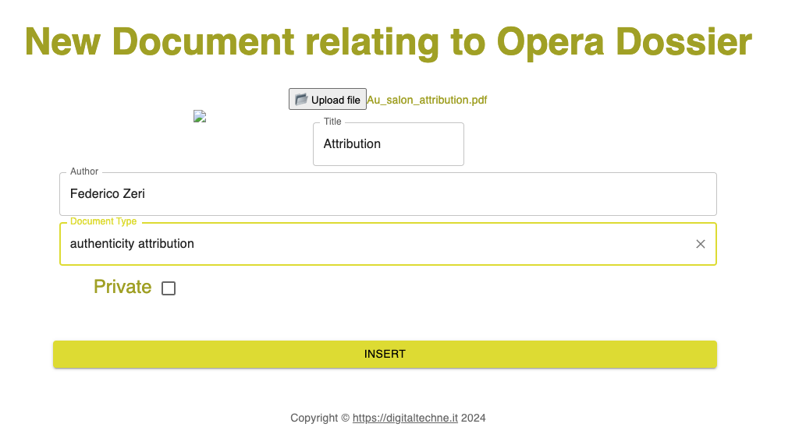

New Document
############

In order to better describe the opera, it is usually very useful to add some documents, being them scientific (chemical analysis, f.i.), legal (certificates of ownership, ..), or artistic (studies, attributions and so on).

Documents can be added in any moment, and each document record contains:

    * the document itself
    * the author of the document
    * the title of the document
    * document type
    * privacy status
    * insert date (automatically inserted)
    * person that inserted the document (auto)
    * file name (auto)
    * mime type (auto)

