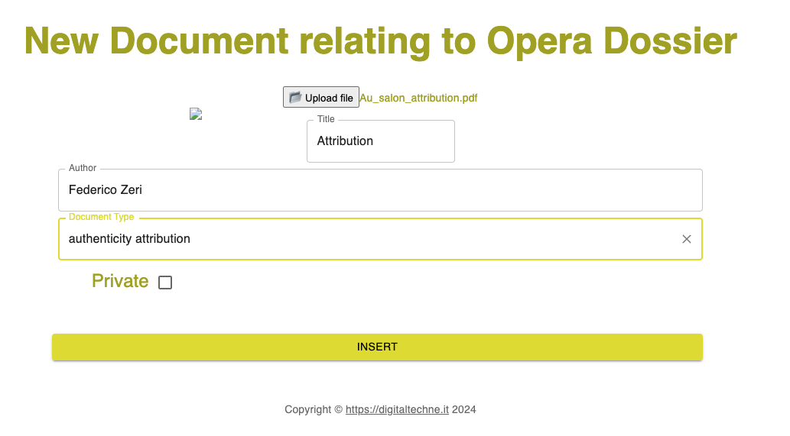

Neues Dokument
############################################################################################

Um die Oper besser zu beschreiben, ist es normalerweise sehr nützlich, einige Dokumente hinzuzufügen, seien sie wissenschaftlicher (chemische Analyse, z. B.), rechtlicher (Eigentumszertifikate, ..) oder künstlerischer (Studien, Zuschreibungen usw.).

Dokumente können jederzeit hinzugefügt werden, und jeder Dokumentdatensatz enthält:

* das Dokument selbst
* den Autor des Dokuments
* den Titel des Dokuments
* Dokumenttyp
* Datenschutzstatus
* Einfügedatum (automatisch eingefügt)
* Person, die das Dokument eingefügt hat (automatisch)
* Dateiname (automatisch)
* MIME-Typ (automatisch)

