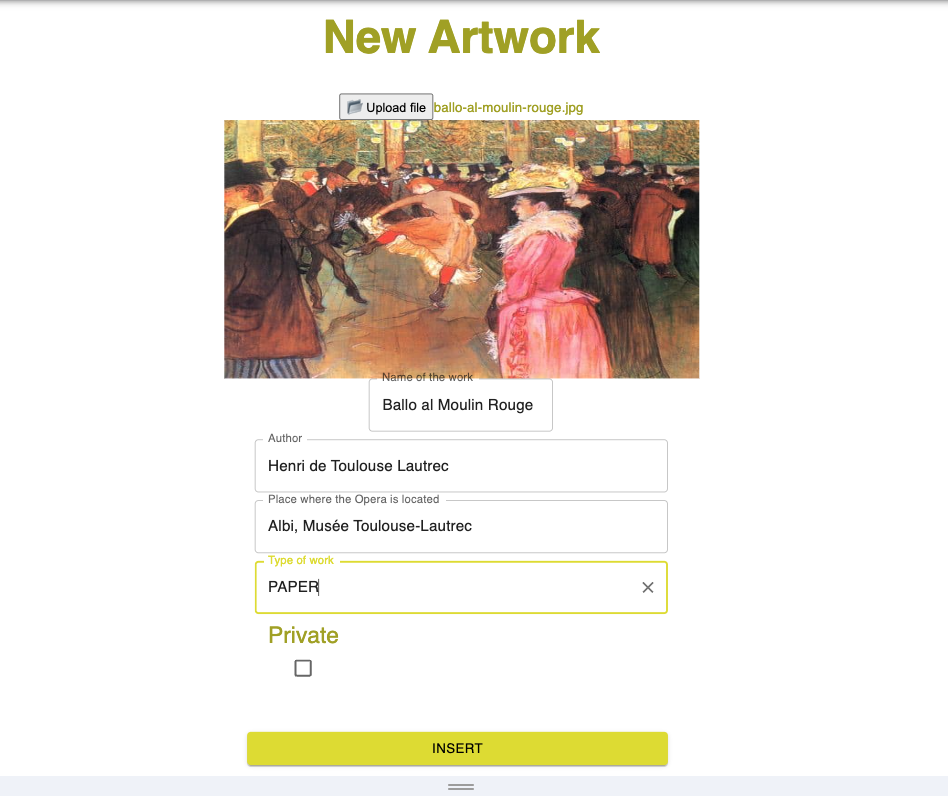

New Dossier
###########

The owner of an artwork will create a folder of information in BC, containing:

    * Base artwork info (this page)
    * Support documentation (proof of ownership, condition report and so on), see here for data input :ref:`New Document`
    * DNA info, see here for details :ref:`Artwork Mark`

The basic information of an opera is mainly:

    * artwork image
    * the title
    * the author
    * the location of the opera
    * the physical support
    * some flags to specify the privacy level (owner, location, support info,...)
    * date of insertion (auto)
    * owner (inferred from the logged user)

