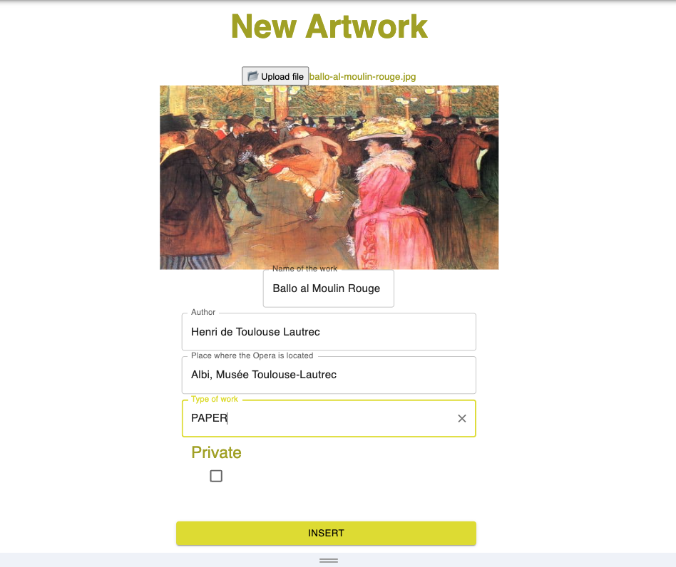

Neues Dossier
##########################################################################################

Der Eigentümer eines Kunstwerks erstellt in BC einen Ordner mit Informationen, der Folgendes enthält:

* Grundlegende Informationen zum Kunstwerk (diese Seite)
* Begleitdokumentation (Eigentumsnachweis, Zustandsbericht usw.), siehe hier für die Dateneingabe :ref:`Neues Dokument`
* DNA-Informationen, siehe hier für Details :ref:`Kunstwerkmarke`

Die grundlegenden Informationen einer Oper sind hauptsächlich:

* Bild des Kunstwerks
* der Titel
* der Autor
* der Standort der Oper
* der physische Träger
* einige Flags zur Angabe der Datenschutzstufe (Eigentümer, Standort, Begleitinformationen, ...)
* Einfügungsdatum (automatisch)
* Eigentümer (abgeleitet vom angemeldeten Benutzer)

