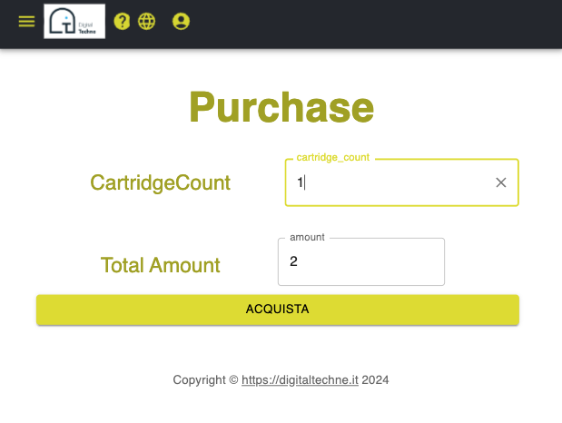

Purchase
#########

At the core of the Signature Kit there is the Ink Cartridge, containing the unique genetic material.

Please note that the effective DNA analysis is held inside the blockchain, what is transfered to the owner is an anonymous identifier

Cartridges are available in the DigitalTechne warehouse, and can be purchased for the artwork signing. They will be available in different forms and cost:

    * single use cartridges
    * multiple copies cartridges (print runs of litographies f.i.)
    * custom labelled for third party solutions
    * bulk purchase
    * ...

The current interface is just a placeholder that will enable the use of cartridges by the artwork owner, and does non involve any real payment

