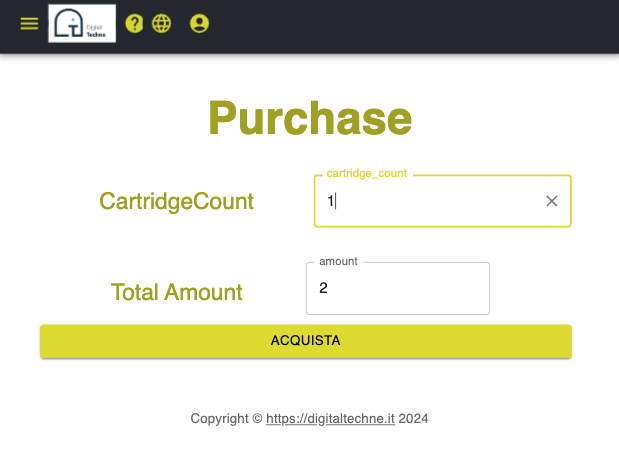

Acquista
#########################################

Al centro del Signature Kit c'è la cartuccia di inchiostro, contenente il materiale genetico unico.

Si prega di notare che l'analisi effettiva del DNA è conservata all'interno della blockchain, ciò che viene trasferito al proprietario è un identificatore anonimo

Le cartucce sono disponibili nel magazzino DigitalTechne e possono essere acquistate per la firma dell'opera d'arte. Saranno disponibili in diverse forme e costi:

* cartucce monouso
* cartucce a più copie (tirature di litografie, ad esempio)
* etichettate personalizzate per soluzioni di terze parti
* acquisto all'ingrosso
* ...

L'interfaccia attuale è solo un segnaposto che consentirà l'uso delle cartucce da parte del proprietario dell'opera d'arte e non comporta alcun pagamento reale

