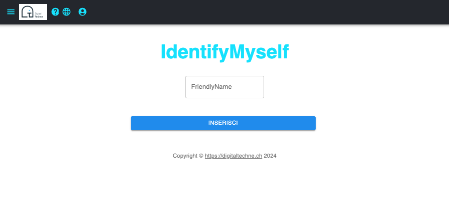

Self Define User
###################

The Internet Computer framework, thanks to the Internet Identity, provides a friendly and secure authentication method.

A new user is automatically  enrolled on first login, with limited capabilities, and no personal information.

The only thing that is required is a self defined user name. Does not need to be unique in the system

