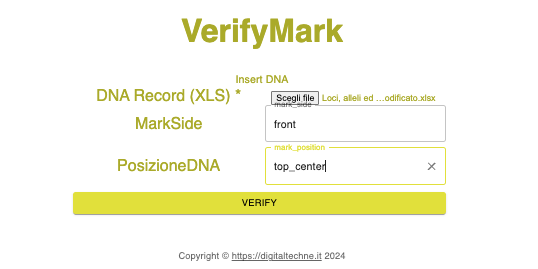
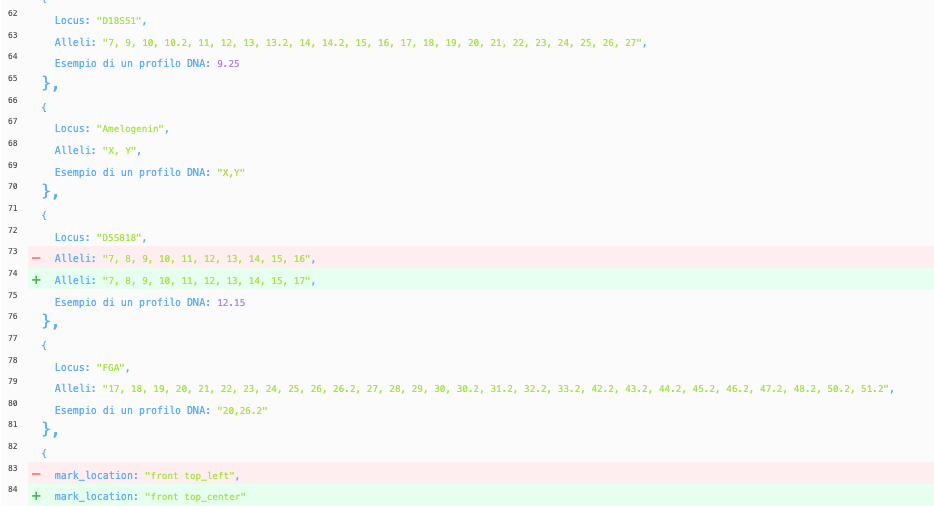

Verify
######

An important feature of the system is the ability to verify the correctness of the association. In any moment you can prove that the physical artwork  is correctly tied to the information in blockchain.

The control, altough not real time, can be easily done: 

    * using a swab you collect a small amount of the DNA material from the physical artwork
    * let a laboratory analyze the specimen
    * load the laboratory results on DigitalTechne
    * have a look ad the differences

Verify operation on DigitalTechne is shown here:
    * upload the file with the laboratory results
    * select from the first pull down menu the artwork side (front, back or frame)
    * select from the second pull down menu the drop position 

The result is a page that will show the genomic details, where the differences will be highlighted.

Moreover, the system will show also the possible differences of the ink position on the artwork

