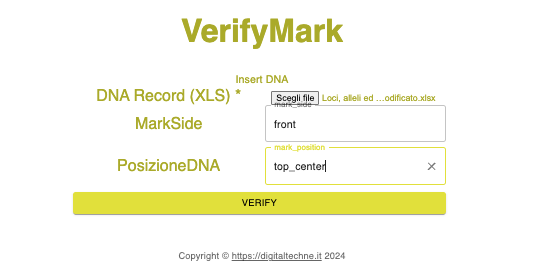
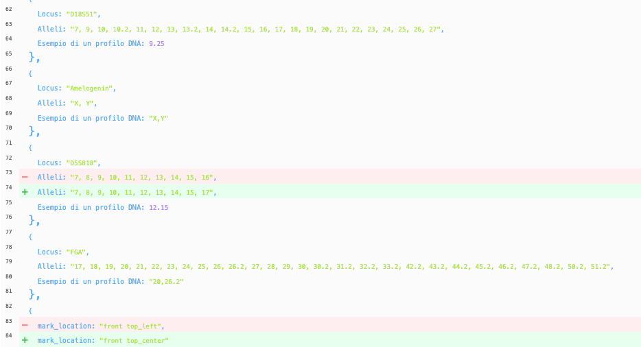

Überprüfen
####################################################################################

Ein wichtiges Merkmal des Systems ist die Möglichkeit, die Richtigkeit der Zuordnung zu überprüfen. Sie können jederzeit beweisen, dass das physische Kunstwerk korrekt mit den Informationen in der Blockchain verknüpft ist.

Die Kontrolle erfolgt zwar nicht in Echtzeit, kann aber leicht durchgeführt werden: 

* Entnehmen Sie mit einem Tupfer eine kleine Menge des DNA-Materials vom physischen Kunstwerk
* Lassen Sie die Probe von einem Labor analysieren
* Laden Sie die Laborergebnisse auf DigitalTechne hoch
* Sehen Sie sich die Unterschiede an

Der Überprüfungsvorgang auf DigitalTechne wird hier gezeigt:
* Laden Sie die Datei mit den Laborergebnissen hoch
* Wählen Sie aus dem ersten Pulldown-Menü die Seite des Kunstwerks (Vorderseite, Rückseite oder Rahmen)
* Wählen Sie aus dem zweiten Pulldown-Menü die Ablageposition

Das Ergebnis ist eine Seite, die die genomischen Details zeigt, wobei die Unterschiede hervorgehoben werden.

Darüber hinaus zeigt das System auch mögliche Unterschiede der Tintenposition auf dem Bildmaterial an.

